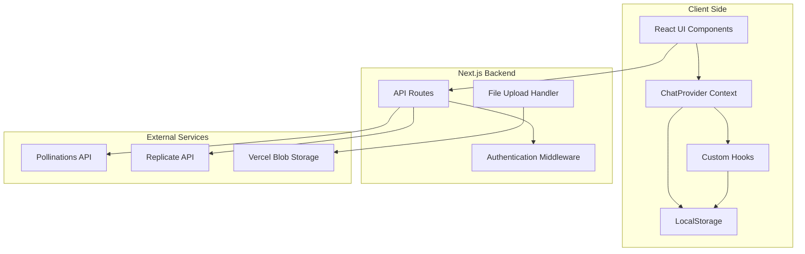
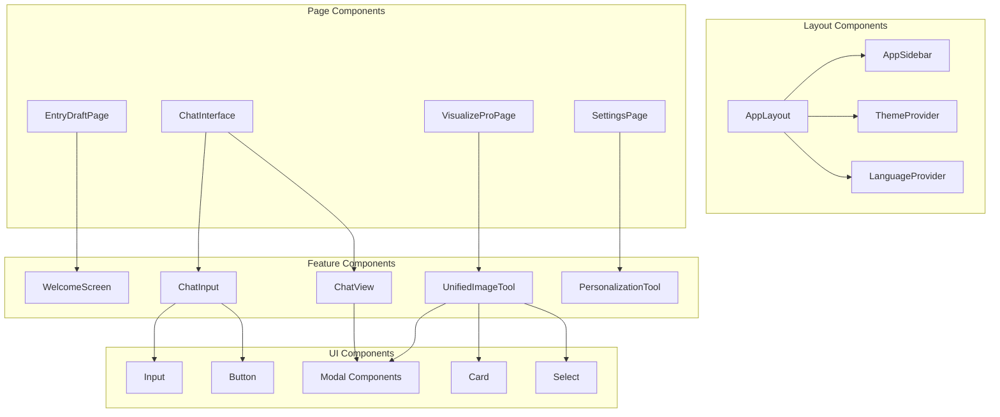
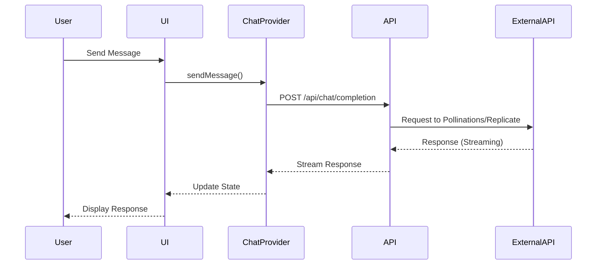
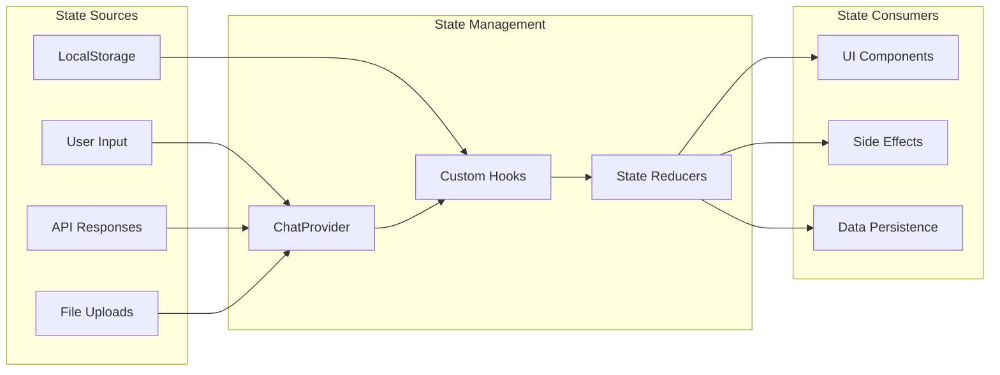
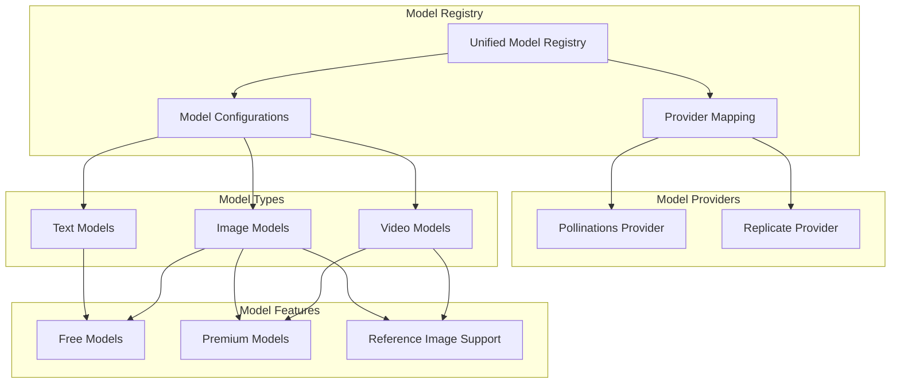
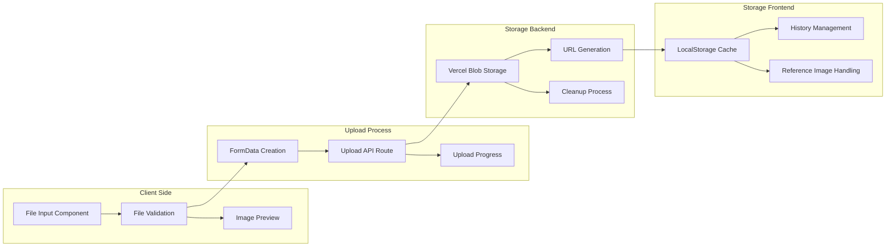

# HeyHi Technical Architecture Diagram

## System Overview



## Component Architecture



## Data Flow Architecture



## State Management Flow



## API Architecture

```mermaid
graph TB
    subgraph "Client"
        Frontend[React Frontend]
    end
    
    subgraph "Next.js API Routes"
        ChatAPI[/api/chat/completion]
        ImageAPI[/api/generate]
        ReplicateAPI[/api/replicate]
        UploadAPI[/api/upload]
        TitleAPI[/api/chat/title]
        STTAPI[/api/stt]
        TTSAPI[/api/tts]
    end
    
    subgraph "External APIs"
        PollinationsChat[Pollinations Chat]
        PollinationsImage[Pollinations Image]
        ReplicateModels[Replicate Models]
    end
    
    subgraph "Storage"
        BlobStorage[Vercel Blob Storage]
    end
    
    Frontend --> ChatAPI
    Frontend --> ImageAPI
    Frontend --> ReplicateAPI
    Frontend --> UploadAPI
    Frontend --> TitleAPI
    Frontend --> STTAPI
    Frontend --> TTSAPI
    
    ChatAPI --> PollinationsChat
    ImageAPI --> PollinationsImage
    ReplicateAPI --> ReplicateModels
    UploadAPI --> BlobStorage
    
    ChatAPI --> TitleAPI
    STTAPI --> PollinationsChat
    TTSAPI --> PollinationsChat
```

## Model Integration Architecture



## File Upload & Storage Architecture



## Authentication & Security Architecture

```mermaid
graph TB
    subgraph "Client Side"
        UserInput[User Input]
        PasswordField[Password Field]
        TokenStorage[Token Storage]
    end
    
    subgraph "Security Layer"
        InputValidation[Input Validation]
        Sanitization[Data Sanitization]
        RateLimiting[Rate Limiting]
    end
    
    subgraph "Authentication"
        PasswordCheck[Password Validation]
        EnvVariables[Environment Variables]
        APIKeyManagement[API Key Management]
    end
    
    subgraph "External API Security"
        ReplicateAuth[Replicate Authentication]
        PollinationsAuth[Pollinations Authentication]
        SecureHeaders[Secure Headers]
    end
    
    UserInput --> InputValidation
    PasswordField --> PasswordCheck
    InputValidation --> Sanitization
    Sanitization --> RateLimiting
    
    PasswordCheck --> EnvVariables
    EnvVariables --> APIKeyManagement
    
    APIKeyManagement --> ReplicateAuth
    APIKeyManagement --> PollinationsAuth
    ReplicateAuth --> SecureHeaders
    PollinationsAuth --> SecureHeaders