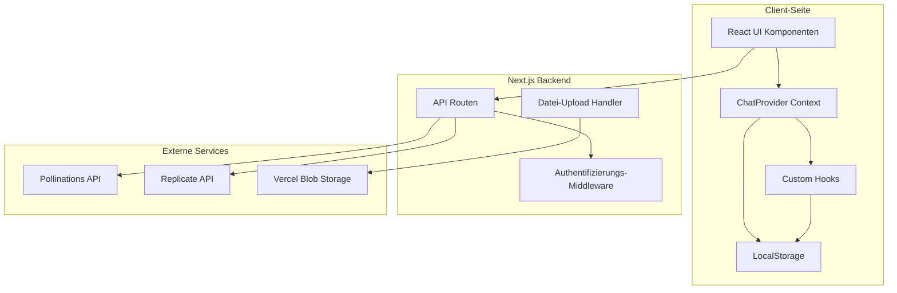
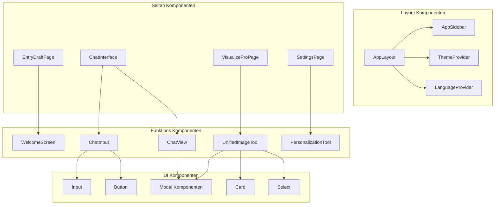
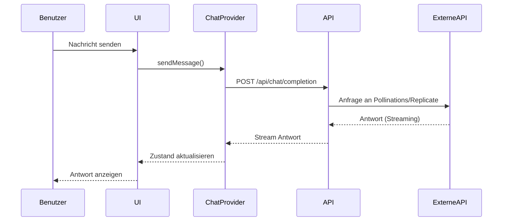
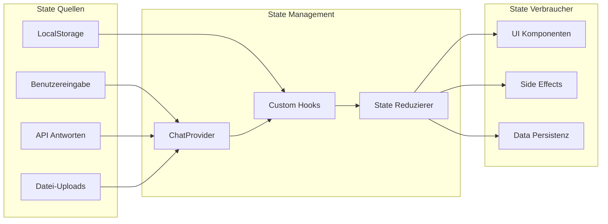
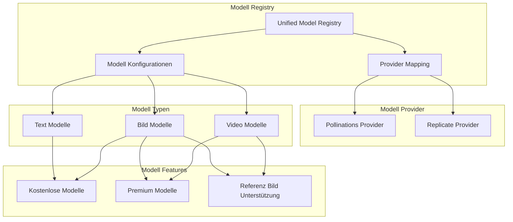
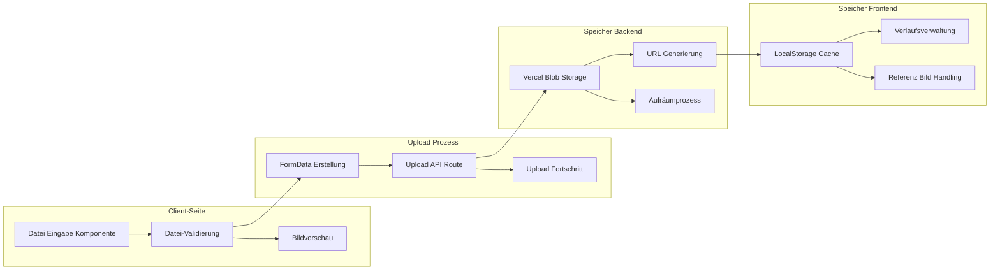

# HeyHi Technische Architektur

## Systemübersicht



## Komponentenarchitektur



## Datenflussarchitektur



## State Management Flow



## API-Architektur

```mermaid
graph TB
    subgraph "Client"
        Frontend[React Frontend]
    end
    
    subgraph "Next.js API Routen"
        ChatAPI[/api/chat/completion]
        BildAPI[/api/generate]
        ReplicateAPI[/api/replicate]
        UploadAPI[/api/upload]
        TitelAPI[/api/chat/title]
        STTAPI[/api/stt]
        TTSAPI[/api/tts]
    end
    
    subgraph "Externe APIs"
        PollinationsChat[Pollinations Chat]
        PollinationsBild[Pollinations Bild]
        ReplicateModelle[Replicate Modelle]
    end
    
    subgraph "Speicher"
        BlobStorage[Vercel Blob Storage]
    end
    
    Frontend --> ChatAPI
    Frontend --> BildAPI
    Frontend --> ReplicateAPI
    Frontend --> UploadAPI
    Frontend --> TitelAPI
    Frontend --> STTAPI
    Frontend --> TTSAPI
    
    ChatAPI --> PollinationsChat
    BildAPI --> PollinationsBild
    ReplicateAPI --> ReplicateModelle
    UploadAPI --> BlobStorage
    
    ChatAPI --> TitelAPI
    STTAPI --> PollinationsChat
    TTSAPI --> PollinationsChat
```

## Modellintegrationsarchitektur



## Datei-Upload & Speicherarchitektur



## Authentifizierung & Sicherheitsarchitektur

```mermaid
graph TB
    subgraph "Client-Seite"
        Benutzereingabe[Benutzereingabe]
        Passwortfeld[Passwortfeld]
        TokenSpeicherung[Token Speicherung]
    end
    
    subgraph "Sicherheitsschicht"
        Eingabevalidierung[Eingabevalidierung]
        Bereinigung[Datenbereinigung]
        Ratenbegrenzung[Ratenbegrenzung]
    end
    
    subgraph "Authentifizierung"
        Passwortprüfung[Passwortvalidierung]
        Umgebungsvariablen[Umgebungsvariablen]
        APISchlüsselVerwaltung[API Schlüssel Verwaltung]
    end
    
    subgraph "Externe API Sicherheit"
        ReplicateAuth[Replicate Authentifizierung]
        PollinationsAuth[Pollinations Authentifizierung]
        SichereHeader[Sichere Header]
    end
    
    Benutzereingabe --> Eingabevalidierung
    Passwortfeld --> Passwortprüfung
    Eingabevalidierung --> Bereinigung
    Bereinigung --> Ratenbegrenzung
    
    Passwortprüfung --> Umgebungsvariablen
    Umgebungsvariablen --> APISchlüsselVerwaltung
    
    APISchlüsselVerwaltung --> ReplicateAuth
    APISchlüsselVerwaltung --> PollinationsAuth
    ReplicateAuth --> SichereHeader
    PollinationsAuth --> SichereHeader